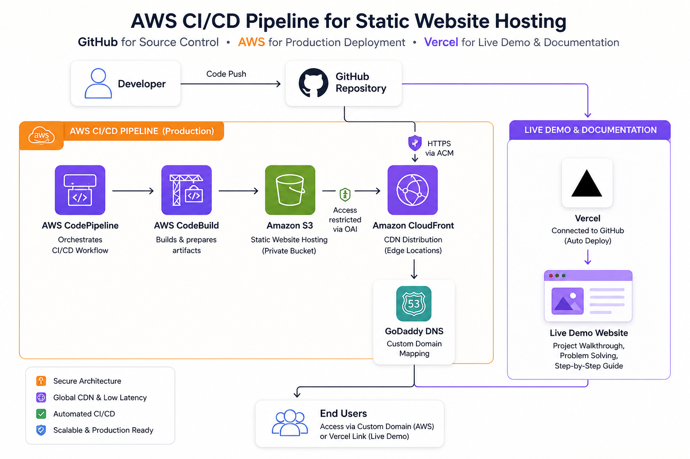

# 🚀 AWS CI/CD Pipeline – Static Website Hosting

## 📌 Overview

This project is a hands-on implementation of an AWS CI/CD pipeline for deploying a static website.

It is based on a tutorial, but the main focus was on understanding cloud concepts, CI/CD workflow, and troubleshooting real deployment issues to build practical DevOps knowledge.

In addition to AWS deployment, I also integrated GitHub with Vercel to host a live demo version of the project, where I explain and demonstrate my implementation process.

## 🏗️ AWS CI/CD Architecture for Static Website Hosting



This diagram shows the end-to-end CI/CD workflow from GitHub → AWS → End Users, including a live Vercel demo layer for documentation and troubleshooting.

```
Developer
   │
   ▼
 GitHub
   │
   ▼
AWS CodePipeline (CI/CD Orchestration)
   │
   ├── Source Stage
   │      └── Fetch latest code from repository
   │
   └── Deploy Stage
          └── Deploy files to S3 Website Bucket
                    │
                    ▼
        Amazon S3 Static Website Bucket (Private)
                    │
          Protected using Origin Access Identity (OAI)
                    │
                    ▼
           Amazon CloudFront (CDN)
                    │
     HTTPS enabled via AWS Certificate Manager (ACM)
                    │
                    ▼
        GoDaddy DNS (Custom Domain Mapping)
                    │
                    ▼
                 End Users
```
             
## ⚙️ CI/CD Pipeline Workflow

### 1. Code Development
- Developer writes and updates static website code (HTML, CSS, JS)
- Code is pushed to GitHub
### 2. Source Stage (CodePipeline)
- AWS CodePipeline is triggered automatically on code changes
- It pulls the latest code from the repository
- Stores the source artifact in an S3 artifact bucket (temporary storage)
### 3. Deploy Stage
- CodePipeline deploys the final output to the S3 static website bucket
- This bucket stores all website files such as:
  - index.html
  - CSS, JS, images
### 4. Secure S3 Access (OAI)
- The S3 bucket is kept private
- Access is restricted using Origin Access Identity (OAI)
- Only CloudFront is allowed to read from the bucket
### 5. Content Delivery via CloudFront
- CloudFront serves the website globally
- Improves performance using edge caching
- Provides secure HTTPS access using AWS Certificate Manager (ACM)
### 6. Domain Routing (GoDaddy DNS)
- Custom domain purchased from GoDaddy
- DNS is configured to point to CloudFront distribution
- Users access the website via a branded domain
### 7. End User Access
- Users access the website securely via HTTPS
- Content is delivered from nearest CloudFront edge location for low latency

## 🎥 Live Demo (Vercel Deployment)

To demonstrate my understanding and problem-solving approach, I also deployed a live version of this project using Vercel.

This includes:

Step-by-step walkthrough of the AWS CI/CD pipeline
Explanation of architecture decisions
Real-time troubleshooting and problem solving
Deployment demonstration using GitHub integration

👉 Live Demo: [https://aws-practical-hands-on.vercel.app/]

## 🧠 Learning Focus
- CI/CD automation in AWS
- Static website hosting on S3
- CDN and caching with CloudFront
- Domain and DNS configuration
- SSL/TLS security implementation
- Infrastructure security best practices (OAI)
- Deployment using Github + Vercel
- Troubleshooting and problem-solving

## 🔐 Key Security Features
- S3 bucket is not publicly accessible
- Access restricted using OAI (CloudFront only access)
- HTTPS enabled using ACM
- CloudFront acts as a secure entry point

## 🔐 Tech Stack Used
- Amazon S3
- AWS CodePipeline
- Amazon CloudFront
- AWS Certificate Manager (ACM)
- Origin Access Identity
- GoDaddy DNS
- Github

## 🧠 Summary

A production-ready simple static website deployment pipeline with automation, and basic security best practices.

## 📌 Key Takeaway

This project demonstrates how AWS services integrate into a real CI/CD pipeline, focusing on automation, security, and global delivery.

🚀 Future Improvements

I will continue improving this project and building new ones progressively from simple to complex architectures as part of my learning journey in:

Cloud Engineering
Cloud Security
DevSecOps

